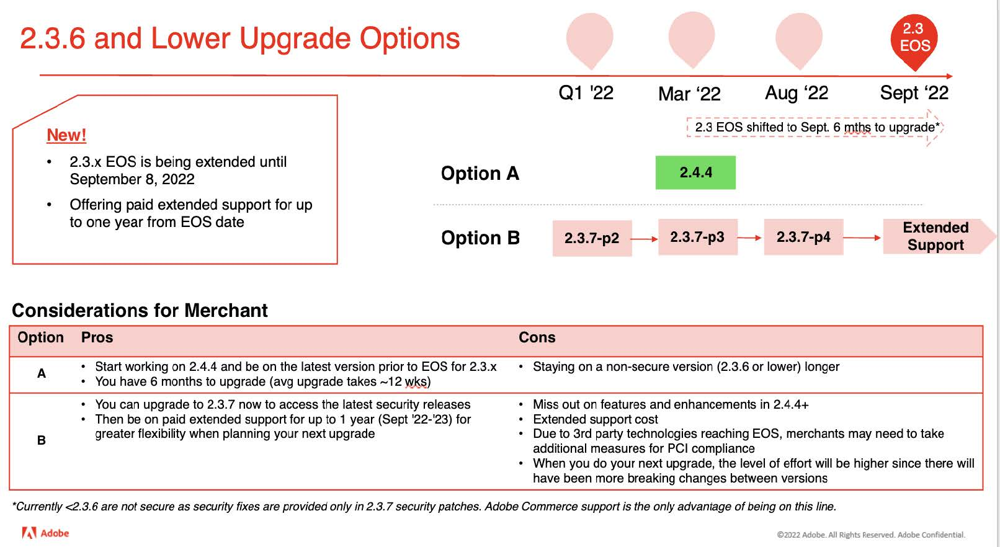

# Percorsi di aggiornamento consigliati per il 2022

Un’implementazione di e-commerce è un’evoluzione: non è mai realmente completa. La tua azienda deve rimanere un passo avanti rispetto alle tendenze, introducendo le funzionalità e le funzionalità più recenti che mantengono il coinvolgimento dei clienti. L&#39;aggiornamento ad Adobe Commerce 2.4.4 o versione successiva ti permette di essere sempre al passo con le innovazioni più avanzate e scalabili del tuo business con:

- Accesso più rapido alle funzioni innovative fornite come servizi SaaS
- Manutenzione e upgrade più semplici ed economici
- Flessibilità e personalizzazione costanti per soddisfare esigenze aziendali specifiche
- Incremento significativo delle prestazioni e della scalabilità
- Migliore esperienza e strumenti per gli sviluppatori
- Possibilità di una maggiore integrazione con altre applicazioni Adobe Experience Cloud

Per offrire ai nostri commercianti maggiore flessibilità nella pianificazione dell&#39;aggiornamento alla versione 2.4.4 o successiva, abbiamo recentemente aggiornato il nostro [Pianificazione del rilascio 2022](https://devdocs.magento.com/release/), ha esteso la data di fine del supporto (EOS) 2.3 e ha annunciato nuove opzioni di supporto esteso per alcune versioni del nostro software. Per maggiori informazioni su questi aggiornamenti, si prega di fare riferimento al nostro blog.

Di seguito sono riportati i percorsi consigliati da Adobe Commerce alla versione 2.4.4 o successiva per garantire la sicurezza e le prestazioni del sito durante l’aggiornamento a una delle versioni più recenti.

## Aggiornamento dalle versioni 2.3.6 e precedenti

## Aggiornamento da 2.3.7

## Aggiornamento da 2.4.0 a 2.4.3

## Aggiornamento da 2.4.3 (o aggiornato di recente)

