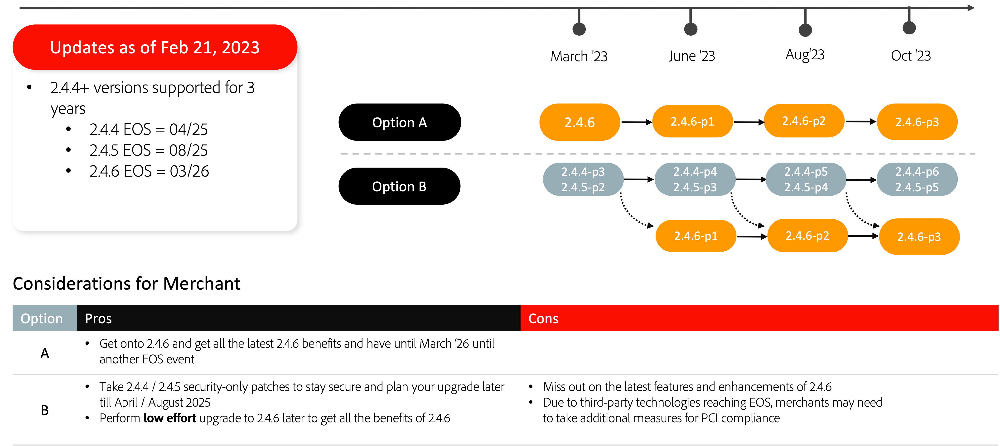

# Percorsi di aggiornamento consigliati

Un’implementazione di eCommerce è un’evoluzione: non è mai realmente completata. La tua azienda deve restare un passo avanti rispetto alle tendenze, introducendo le funzionalità più recenti che mantengono i tuoi clienti coinvolti. L’aggiornamento alla versione più recente di Adobe Commerce ti consente di restare all’avanguardia con innovazioni all’avanguardia e di garantire il futuro della tua azienda con:

- Accesso più rapido alle funzionalità innovative fornite come servizi SaaS
- Manutenzione e aggiornamenti più semplici ed economici
- Flessibilità e personalizzazione costanti per soddisfare esigenze aziendali specifiche
- Aumento significativo delle prestazioni e della scalabilità
- Migliore esperienza e strumenti per gli sviluppatori
- Possibilità di una maggiore integrazione con altre applicazioni Adobe Experience Cloud

Per offrire ai nostri esercenti maggiore flessibilità nella pianificazione degli aggiornamenti, abbiamo recentemente aggiornato Adobe Commerce [pianificazione delle versioni](../../release/schedule.md), ha esteso la data di fine del supporto (EOS) 2.3 e ha annunciato nuove opzioni di supporto esteso per alcune versioni del software. Per ulteriori informazioni su questi aggiornamenti, vedi [Supporto esteso per Adobe Commerce](https://business.adobe.com/blog/the-latest/adobe-announces-expanded-support).

Di seguito sono riportati i percorsi di aggiornamento consigliati da Adobe Commerce per mantenere il sito sicuro e performante durante l’aggiornamento a una delle versioni più recenti.

## Aggiornamento da 2.3.7

## Aggiornamento da 2.4.0 a 2.4.3

## Aggiornamento da 2.4.4 e 2.4.5

