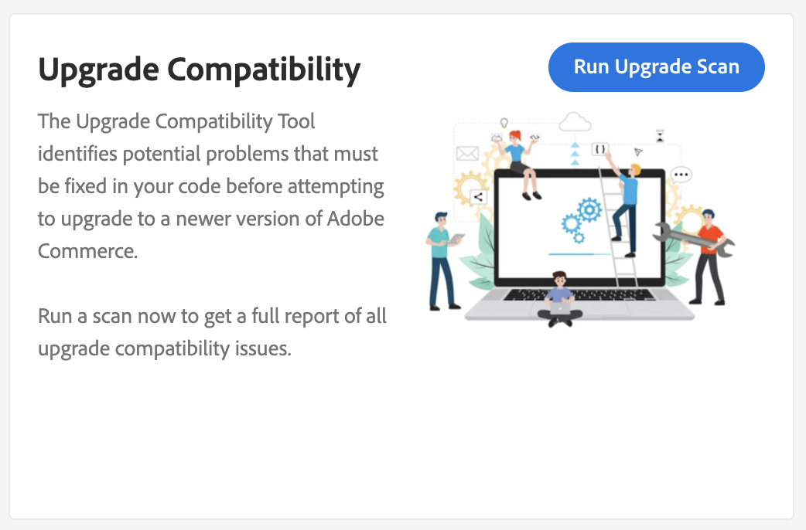

# Integra [!DNL Site-Wide Analysis Tool]

[!DNL Site-Wide Analysis Tool] fornisce monitoraggio delle prestazioni in tempo reale 24 ore su 24, 7 giorni su 7, rapporti e raccomandazioni per garantire la sicurezza e l&#39;operabilità delle istanze di Adobe Commerce.

[!DNL Upgrade Compatibility Tool] è ora integrato con [!DNL Site-Wide Analysis Tool] per consentire agli utenti non tecnici di eseguire [!DNL Upgrade Compatibility Tool] e ottenere un [report](../upgrade-compatibility-tool/reports.md) contenente un elenco di problemi per ogni file.

Per ulteriori informazioni, consulta la [[!DNL Site-Wide Analysis Tool] guida utente](/help/tools/site-wide-analysis-tool/access.md).

## Esegui [!DNL Upgrade Compatibility Tool] da [!DNL Site-Wide Analysis Tool]

Passa alla dashboard [!DNL Site-Wide Analysis Tool] per il progetto e individua il widget [!DNL Upgrade Compatibility Tool].

Fare clic su **[!UICONTROL Run Upgrade Scan]**. La scansione può richiedere un po’ di tempo a seconda delle dimensioni del progetto. Un rotatore indica che la scansione è in corso.

Una volta completata la scansione, i risultati di alto livello vengono visualizzati nel widget.

Fare clic su **[!UICONTROL Download Report]** per recuperare il [!DNL Upgrade Compatibility Tool] [report HTML](../upgrade-compatibility-tool/reports.md#html-report) e rivedere i dettagli.

>[!NOTE]
>
> L&#39;esecuzione di [!DNL Upgrade Compatibility Tool] tramite [!DNL Site-Wide Analysis Tool] ottimizza i risultati e consente di concentrarsi sui problemi nuovi e critici per l&#39;aggiornamento di destinazione. Utilizza l&#39;opzione [`--ignore-current-version-compatibility-errors`](run.md#optimize-your-results) e mostra sempre i risultati confrontando la versione del progetto con l&#39;ultima versione rilasciata.
