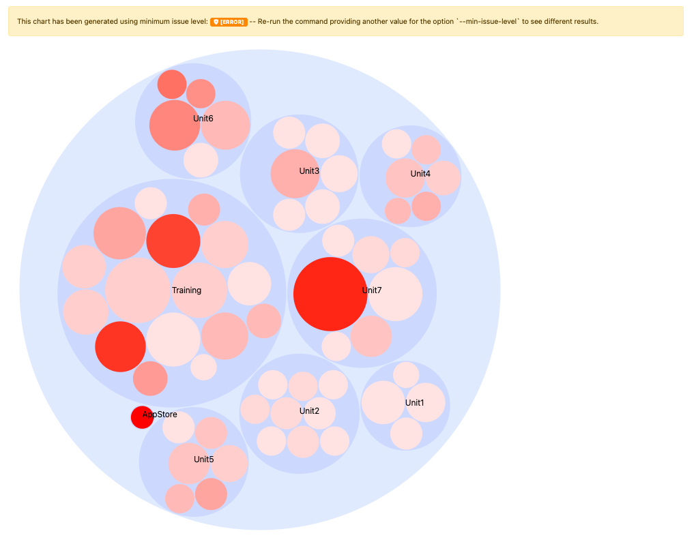

# Rapporti

{{commerce-only}}

A seguito dell&#39;analisi, il [!DNL Upgrade Compatibility Tool] esporta un rapporto che contiene un elenco di problemi per ogni file, specificando la gravità, il codice di errore e la descrizione dell’errore.

Vedi l&#39;esempio seguente:

```terminal
File: /app/code/Custom/CatalogExtension/Controller/Index/Index.php
------------------------------------------------------------------
 * [WARNING][1131] Line 23: Extending from class 'Magento\Framework\App\Action\Action' that is @deprecated on version '2.4.2'
 * [ERROR][1429] Line 103: Call method 'Magento\Framework\Api\SearchCriteriaBuilder::addFilters' that is non API on version '2.4.2'
 * [CRITICAL][1110] Line 60: Instantiating class/interface 'Magento\Catalog\Model\ProductRepository' that does not exist on version '2.4.2'
```

Controlla la [Riferimento al messaggio di errore](../upgrade-compatibility-tool/error-messages.md) per ulteriori informazioni.

Il rapporto include anche un riepilogo dettagliato che mostra:

- *Versione corrente*: versione attualmente installata.
- *Versione di destinazione*: la versione a cui desideri eseguire l’aggiornamento.
- *Tempo di esecuzione*: il tempo impiegato dall&#39;analisi per costruire il rapporto (mm:ss).
- *Moduli che richiedono aggiornamento*: la percentuale di moduli che contengono problemi di compatibilità e richiedono l’aggiornamento.
- *File che richiedono l’aggiornamento*: la percentuale di file che contengono problemi di compatibilità e richiedono l’aggiornamento.
- *Errori critici totali*: numero di errori critici rilevati.
- *Errori totali*: numero di errori rilevati.
- *Avvisi totali*: numero di avvisi rilevati.

Vedi l&#39;esempio seguente:

```terminal
 ----------------------------- ------------------
  Current version               2.4.2
  Target version                2.4.3
  Execution time                1m:10s
  Modules that require update   78.33% (47/60)
  Files that require update     21.62% (115/532)
  Total critical issues         35
  Total errors                  201
  Total warnings                103
 ----------------------------- ------------------
```

>[!NOTE]
>
>Per impostazione predefinita, la [!DNL Upgrade Compatibility Tool] esporta il rapporto in 2 formati diversi: `json` e `html`.

## File JSON

Il file JSON contiene esattamente le stesse informazioni mostrate nell’output:

- Elenco dei problemi individuati.
- Sintesi dell&#39;analisi.

Per ogni problema riscontrato, il rapporto fornisce informazioni dettagliate, ad esempio la gravità e la descrizione del problema.

Per esportare il rapporto in una cartella di output diversa, esegui:

```bash
bin/uct upgrade:check <dir> --json-output-path[=JSON-OUTPUT-PATH]
```

Se gli argomenti sono i seguenti:

- `<dir>`: Directory di installazione di Adobe Commerce.
- `[=JSON-OUTPUT-PATH]`: Directory del percorso per esportare `.json` file di output.

>[!NOTE]
>
>Il percorso predefinito per la cartella di output è `var/output/[TIME]-results.json`.

## Rapporto HTML

Il file HTML contiene anche il riepilogo delle analisi e l’elenco dei problemi identificati. È possibile ottenere il rapporto di HTML durante l&#39;esecuzione dello strumento su un&#39;interfaccia a riga di comando o tramite [!DNL Site-Wide Analysis Tool].


Puoi navigare facilmente tra i problemi identificati durante il [!DNL Upgrade Compatibility Tool] analisi:


Il rapporto HTML include anche quattro diversi grafici:

- **Moduli per gravità del problema**: Mostra la distribuzione della gravità per moduli.
- **File per gravità del problema**: Mostra la distribuzione della gravità per file.
- **Moduli ordinati per numero totale di problemi**: Mostra i 10 moduli più compromessi tenendo conto di avvisi, errori ed errori critici.
- **Moduli con dimensioni e problemi relativi**: Più file contiene un modulo, più grande è il suo cerchio. Più problemi ha un modulo, più rosso appare il suo cerchio.

Questi grafici ti consentono di identificare, a colpo d&#39;occhio, le parti più compromesse e quelle che richiedono più lavoro per eseguire un aggiornamento.


Puoi filtrare i problemi visualizzati nel rapporto in base al livello di problema minimo. Il valore predefinito è `WARNING`.

Nell’angolo in alto a destra è disponibile un menu a discesa che consente di selezionarne uno diverso in base alle esigenze. L&#39;elenco dei problemi identificati sarà filtrato di conseguenza.


Tieni presente che i problemi con il livello di problema inferiore vengono eliminati ma ottieni una notifica in modo da essere sempre a conoscenza dei problemi identificati per modulo.

Anche i diagrammi vengono aggiornati di conseguenza, con l&#39;unica eccezione del `Modules with relative sizes and issues`, generato con il `min-issue-level` configurazione iniziale.

Se si desidera visualizzare risultati diversi, è necessario eseguire nuovamente il comando fornendo un altro valore per `--min-issue-level` opzione .



Per esportare il rapporto in una cartella di output diversa, esegui:

```bash
bin/uct upgrade:check <dir> --html-output-path[=HTML-OUTPUT-PATH]
```

Se gli argomenti sono i seguenti:

- `<dir>`: Directory di installazione di {{site.data.var.ee}}.
- `[=HTML-OUTPUT-PATH]`: Directory del percorso per esportare `.html` file di output.

>[!NOTE]
>
> Il percorso predefinito per la cartella di output è `var/output/[TIME]-results.html`.
